# Stock Prediction Portal

A full-stack web application for stock price prediction using machine learning. The project consists of a React frontend built with Vite and a Django REST Framework backend.

## 🚀 Features

- **Real-time Stock Data**: Fetch and display current stock prices
- **ML Predictions**: Machine learning-powered stock price predictions
- **User Authentication**: Secure user registration and login system
- **Interactive Dashboard**: Modern and responsive user interface
- **API Integration**: RESTful API for seamless data communication

## 🛠️ Tech Stack

### Frontend
- **Vite** - Fast build tool and development server
- **React Router DOM** - Client-side routing
- **Axios** - HTTP client for API requests
- **FontAwesome** - Icon library for UI components

### Backend
- **Django 5.0.6** - Python web framework
- **Django REST Framework** - Toolkit for building Web APIs
- **JWT Authentication** - Secure token-based authentication
- **CORS Headers** - Cross-Origin Resource Sharing support
- **SQLite** - Default database (can be configured for other databases)

### Machine Learning Stack
- **TensorFlow/Keras** - Deep learning framework for LSTM model implementation
- **LSTM Neural networks** - Long Short-Term Memory networks for time series prediction
- **scikit-learn** - Data preprocessing and model evaluation metrics
- **yfinance** - Real-time stock data fetching from Yahoo Finance
- **pandas & numpy** - Data manipulation and numerical computations
- **matplotlib** - Data visualization and plotting

## 📋 Prerequisites

Before running this application, make sure you have the following installed:
- **npm** or **yarn**
- **Python** (v3.8 or higher)
- **pip** (Python package installer)

## 🚀 Quick Start

### 1. Clone the Repository

```bash
git clone <repository-url>
cd Stock-prediction-portal
```

### 2. Backend Setup (Django)

1. **Navigate to the backend directory:**
   ```bash
   cd backend-drf
   ```

2. **Create and activate a virtual environment:**
   ```bash
   # Windows
   python -m venv env
   env\Scripts\activate

   # macOS/Linux
   python3 -m venv env
   source env/bin/activate
   ```

3. **Install Python dependencies:**
   ```bash
   pip install django djangorestframework django-cors-headers python-decouple djangorestframework-simplejwt tensorflow scikit-learn yfinance pandas numpy matplotlib
   ```

4. **Set up environment variables:**
   - Create a `.env` file in the `backend-drf` directory
   - Add your configuration (SECRET_KEY, DEBUG, etc.)

5. **Run database migrations:**
   ```bash
   python manage.py migrate
   ```

6. **Create a superuser (optional):**
   ```bash
   python manage.py createsuperuser
   ```

7. **Start the Django development server:**
   ```bash
   python manage.py runserver
   ```
   
   The backend API will be available at `http://127.0.0.1:8000/`

### 3. Frontend Setup (React)

1. **Navigate to the frontend directory:**
   ```bash
   cd frontend-react
   ```

2. **Install Node.js dependencies:**
   ```bash
   npm install
   ```

3. **Start the development server:**
   ```bash
   npm run dev
   ```
   
   The frontend application will be available at `http://localhost:5173/`

## 🔧 Development Workflow

1. **Start the backend server:**
   ```bash
   cd backend-drf
   python manage.py runserver
   ```

2. **In a new terminal, start the frontend server:**
   ```bash
   cd frontend-react
   npm run dev
   ```

3. **Access the application:**
   - Frontend: `http://localhost:5173/`
   - Backend API: `http://127.0.0.1:8000/`
   - Django Admin: `http://127.0.0.1:8000/admin/`

## 📁 Project Structure

```
Stock-prediction-portal/
├── backend-drf/                 # Django backend
│   ├── accounts/               # User authentication app
│   ├── api/                    # Main API app
│   ├── stock_prediction_main/  # Django project settings
│   ├── manage.py              # Django management script
│   └── db.sqlite3             # SQLite database
├── frontend-react/             # React frontend
│   ├── src/                   # Source code
│   ├── public/                # Static assets
│   ├── package.json           # Node.js dependencies
│   └── vite.config.js         # Vite configuration
├── Resources/                  # ML resources and notebooks
│   └── stock_prediction_using_LSTM.ipynb  # LSTM model implementation
└── README.md                  # Project documentation
```

## 🤖 Machine Learning Implementation

### LSTM Model Architecture

The stock prediction system uses a **Long Short-Term Memory (LSTM)** neural network, specifically designed for time series forecasting. The model architecture consists of:

#### **Model Structure:**
```python
Sequential Model:
├── Input Layer: (100, 1) - 100 timesteps with 1 feature (closing price)
├── LSTM Layer 1: 128 units with tanh activation, return_sequences=True
├── LSTM Layer 2: 64 units with tanh activation
├── Dense Layer 1: 25 neurons (feature reduction)
└── Dense Layer 2: 1 neuron (final prediction)

Total Parameters: ~117,593
```

#### **Key Components:**

- **📊 Data Source**: Real-time stock data fetched using `yfinance` API
- **🔄 Data Preprocessing**: MinMaxScaler normalization (0-1 range) for faster convergence
- **📈 Sequence Creation**: 100-day historical price windows to predict next day's price
- **🧠 LSTM Layers**: 
  - **Layer 1 (128 units)**: Learns basic temporal patterns with sequence output
  - **Layer 2 (64 units)**: Learns higher-level patterns from first layer
- **🎯 Dense Layers**: Combine temporal features and output final prediction

#### **Training Configuration:**
- **Optimizer**: Adam (adaptive learning rate)
- **Loss Function**: Mean Squared Error (MSE)
- **Training Epochs**: 50 iterations
- **Input Sequence**: 100 consecutive trading days
- **Output**: Next day's closing price prediction

#### **Model Performance Metrics:**
- **Mean Squared Error (MSE)**: Measures prediction accuracy
- **R-Squared Score**: Indicates model's explanatory power
- **Visual Comparison**: Actual vs Predicted price charts

#### **Data Flow:**
1. **Data Collection**: Fetch historical stock data via yfinance
2. **Preprocessing**: Scale data using MinMaxScaler (0-1 range)
3. **Sequence Creation**: Create 100-day input sequences
4. **Model Training**: Train LSTM on historical patterns
5. **Prediction**: Generate next-day price predictions
6. **Evaluation**: Calculate MSE and R² metrics

#### **Why LSTM for Stock Prediction?**
- **Memory Capability**: Remembers long-term dependencies in price movements
- **Temporal Pattern Recognition**: Identifies recurring market patterns
- **Gradient Flow**: Solves vanishing gradient problem in traditional RNNs
- **Sequential Processing**: Handles time-series data naturally

## 🔬 How the ML Model Works

### **Step-by-Step Working Process:**

#### **1. Data Collection & Preparation**
```python
# Fetch stock data using yfinance
import yfinance as yf
data = yf.download('AAPL', start='2020-01-01', end='2024-01-01')
closing_prices = data['Close'].values
```
- **Data Source**: Historical stock prices from Yahoo Finance API
- **Time Range**: Typically 3-5 years of historical data
- **Features**: Primarily closing prices (can be extended to OHLCV)
- **Data Quality**: Handles missing values and market holidays

#### **2. Data Preprocessing & Normalization**
```python
# Scale data to 0-1 range for better neural network performance
from sklearn.preprocessing import MinMaxScaler
scaler = MinMaxScaler(feature_range=(0,1))
scaled_data = scaler.fit_transform(closing_prices.reshape(-1,1))
```
- **Why Normalize?**: Neural networks perform better with scaled inputs
- **Range**: Values scaled between 0 and 1
- **Benefit**: Prevents large price values from dominating the learning process
- **Reversible**: Predictions are inverse-transformed back to actual price scale

#### **3. Sequence Creation (Sliding Window)**
```python
# Create sequences of 100 days to predict the next day
def create_sequences(data, seq_length=100):
    X, y = [], []
    for i in range(seq_length, len(data)):
        X.append(data[i-seq_length:i, 0])  # Past 100 days
        y.append(data[i, 0])               # Next day price
    return np.array(X), np.array(y)
```
- **Input Window**: 100 consecutive trading days
- **Output Target**: The very next day's closing price
- **Logic**: "Given the last 100 days of prices, predict tomorrow's price"
- **Training Examples**: Each sequence becomes one training sample

#### **4. LSTM Neural Network Processing**

**🧠 How LSTM Cells Work:**
```
Day 1 → [LSTM Cell] → Hidden State 1
Day 2 → [LSTM Cell] → Hidden State 2 (remembers Day 1)
Day 3 → [LSTM Cell] → Hidden State 3 (remembers Day 1-2)
...
Day 100 → [LSTM Cell] → Final Hidden State → Prediction
```

**Memory Mechanism:**
- **Forget Gate**: Decides what information to discard from previous days
- **Input Gate**: Determines what new information to store
- **Output Gate**: Controls what parts of memory to use for prediction
- **Cell State**: Long-term memory that flows through the sequence

#### **5. Model Training Process**
```python
# Training loop
for epoch in range(50):
    for batch in training_data:
        # Forward pass
        predictions = model(batch_X)
        loss = mse_loss(predictions, batch_y)
        
        # Backward pass
        loss.backward()
        optimizer.step()
```
- **Forward Pass**: Input sequences flow through LSTM layers
- **Loss Calculation**: Compare predictions with actual next-day prices
- **Backpropagation**: Adjust weights to minimize prediction error
- **Optimization**: Adam optimizer adapts learning rate automatically

#### **6. Prediction Generation**
```python
# Making predictions
last_100_days = get_recent_data()  # Most recent 100 days
scaled_input = scaler.transform(last_100_days)
prediction = model.predict(scaled_input)
actual_price = scaler.inverse_transform(prediction)
```

### **🔄 Complete ML Workflow**

```mermaid
graph TD
    A[Stock Symbol Input] --> B[Fetch Historical Data via yfinance]
    B --> C[Data Preprocessing & Cleaning]
    C --> D[MinMax Scaling 0-1]
    D --> E[Create 100-day Sequences]
    E --> F[Split Train/Test Data]
    F --> G[LSTM Model Training]
    G --> H[Model Evaluation MSE/R²]
    H --> I{Model Performance OK?}
    I -->|No| J[Adjust Hyperparameters]
    J --> G
    I -->|Yes| K[Save Trained Model]
    K --> L[Real-time Prediction API]
    L --> M[Frontend Visualization]
```



### **🎯 Real-World Application Flow**

1. **User Request**: User selects a stock symbol (e.g., AAPL, GOOGL)
2. **Data Fetching**: System downloads latest 100+ days of price data
3. **Preprocessing**: Data is cleaned and normalized
4. **Model Inference**: LSTM processes the sequence and generates prediction
5. **Post-processing**: Prediction is scaled back to actual price range
6. **Visualization**: Results displayed with confidence intervals and charts
7. **Continuous Learning**: Model can be retrained with new data periodically

### **📊 Model Performance Understanding**

#### **Evaluation Metrics:**
- **MSE (Mean Squared Error)**: Lower values indicate better accuracy
- **R² Score**: Closer to 1.0 means model explains more price variance
- **Visual Analysis**: Plotting predicted vs actual prices shows model behavior

#### **Model Limitations:**
- **Market Volatility**: Sudden news/events can't be predicted from price history alone
- **External Factors**: Economic indicators, company news not included in basic model
- **Overfitting Risk**: Model might memorize patterns that don't generalize
- **Time Sensitivity**: Model performance may degrade over time without retraining

### 📊 ML Pipeline Integration

The trained LSTM model integrates with the Django backend through:
- **API Endpoints**: RESTful APIs for prediction requests
- **Real-time Data**: Live stock data fetching and processing
- **Model Serving**: Efficient prediction serving to frontend
- **Data Visualization**: Interactive charts showing predictions vs actual prices

## 🔐 Environment Variables

Create a `.env` file in the `backend-drf` directory with the following variables:

```env
SECRET_KEY=your-secret-key-here
DEBUG=True
```

## 🚀 Deployment

### Frontend Deployment
```bash
cd frontend-react
npm run build
# Deploy the dist/ folder to your hosting service
```

### Backend Deployment
- Configure your production database
- Set `DEBUG=False` in production
- Configure static files serving
- Set up proper environment variables

## 📝 License

This project is licensed under the MIT License - see the LICENSE file for details.